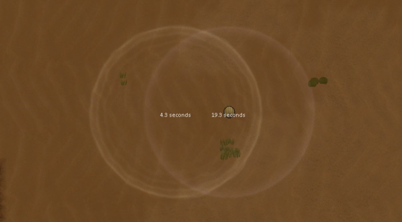

# [RX] Shield Timer

Show the remaining shield time.

## Features:
1. Add a Mote timer for skipshield and burnout low-shield.
2. Toggle the timer for each kind of shield in the mod options.

## Warning:
* Don't generate too many shields at once, or it may crash your game.

## Acknowledgements
1. Harmony  
https://steamcommunity.com/workshop/filedetails/?id=2009463077

2. RimWorld Wiki  
https://rimworldwiki.com/wiki/Modding_Tutorials